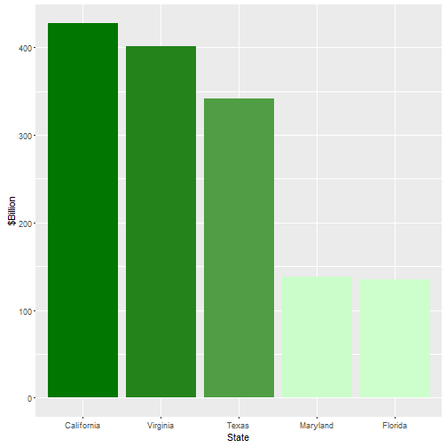
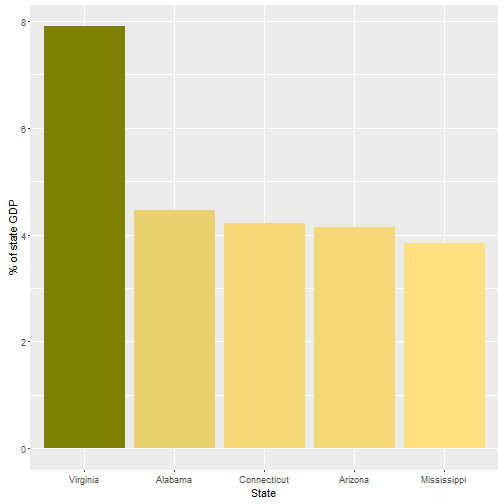
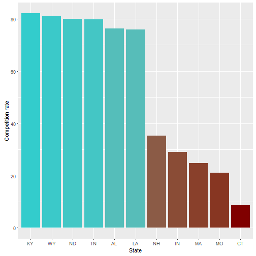
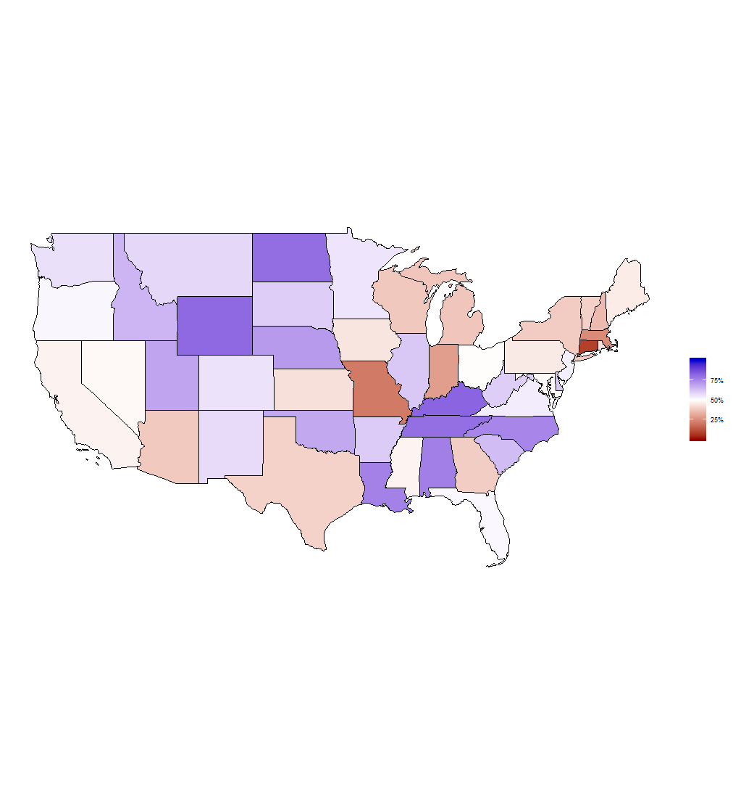

R Shiny Demo: DoD Competition
========================================================
author: L. Lipsey for DIIG
date: May 2016
transition: fade

[Code and documentation on GitHub](https://github.com/lipseylc/DoD-Competition-Shiny-Demo)

Where is DoD spending procurement money?
========================================================

- Where is the most money spent?
- Where is spending most important to the state economy?
- Where is contracting most (and least) competitive?

Where is the most money spent?
========================================================
Top 5 states by DoD contract spending   
2000-2014 (constant 2014 dollars)

Where is spending most important to the state economy?
========================================================
Top 5 states by defense contract economic share   
2000-2014 (percentage of state GDP)

Where is the most and least competition?
========================================================
Top and bottom 5 states by competition rate   
2000-2014 (percentage of multi-bid contracts)

Interactive map available!
==========================================================
Check out interactive map of these variables and more:
[https://diig.shinyapps.io/DoDcompetition/](https://diig.shinyapps.io/DoDcompetition/)

